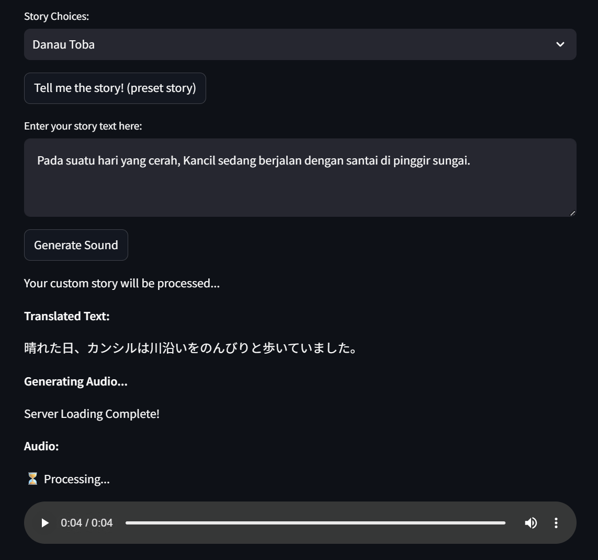
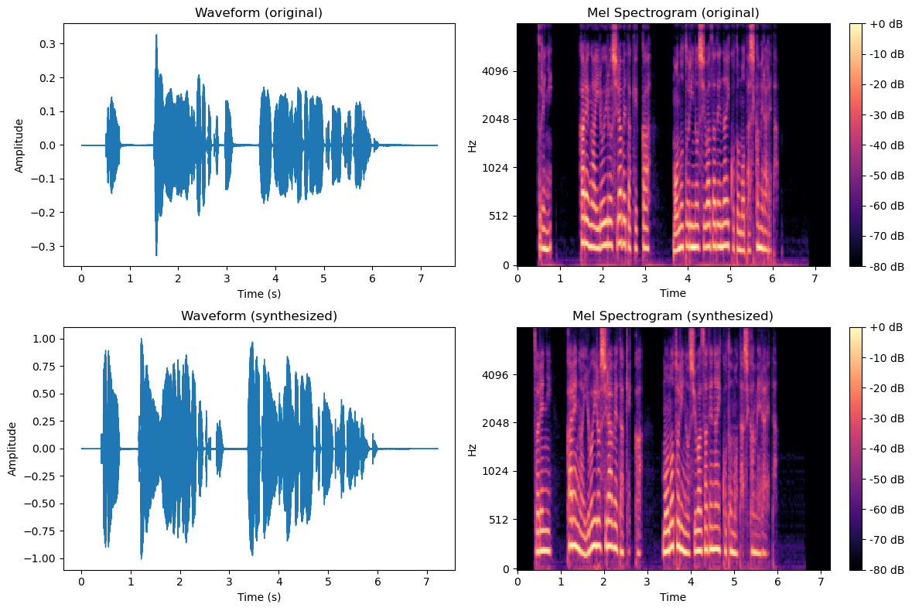

<a id="readme-top"></a>

<!-- TABLE OF CONTENTS -->
<details>
  <summary>Table of Contents</summary>
  <ol>
    <li>
      <a href="#ttdsdidjp">About The Project</a>
    </li>
    <li>
      <a href="#getting-started">Getting Started</a>
      <ul>
        <li>
          <a href="#ftcd">Fine-tuning Custom Dataset</a>
          <ul>
            <li><a href="#pcd">Preparing Custom Dataset</a></li>
            <li><a href="#ftp">Fine-tuning Process</a></li>
          </ul>
        </li>
        <li>
          <a href="#iuftm">Inference using Fine-tuned Model</a>
          <ul>
            <li><a href="#uyod">Using Your Own Device</a></li>
            <li><a href="#ugc">Using Google Colab</a></li>
          </ul>
        </li>
      </ul>
    </li>
    <li><a href="#usage">Usage</a></li>
    <li><a href="#references">References</a></li>
    <li><a href="#acknowledgments">Acknowledgments</a></li>
    <li><a href="#license">License</a></li>
  </ol>
</details>

<!-- ABOUT THE PROJECT -->
<a id="ttdsdidjp"></a>
## About TTSDS-ID-JP

This **"Indonesian Folklore Storytelling in Japanese with Text-to-Speech (TTSDS-ID-JP)"** project proposes an integrated framework for cross-lingual folklore preservation by automating the conversion of Indonesian folk narratives into Japanese speech. The system combines machine translation and text-to-speech (TTS) synthesis: Google Translate converts Indonesian text into Japanese, and a fine-tuned Style-Bert-VITS2 model generates high-quality, expressive speech. The models in this project were fine-tuned on a dataset sourced from the YouTube channel of the virtual YouTuber (VTuber) [Suo Sango](https://www.youtube.com/@SuoSango). 

This work is intended for use within the private research community of the Human-AI Interaction Laboratory at Nara Institute of Science and Technology University (NAIST). For scholarly investigations, please contact the author at michaelbrian2002@gmail.com to obtain the pre-fine-tuned model token on `Hugging Face` or use your own fine-tuned model.

**Note:** As this repository contains models fine-tuned on a custom dataset, you must provide your own tokens and credentials to clone and use it.

<p align="right">(<a href="#readme-top">back to top</a>)</p>

<!-- GETTING STARTED -->
## Getting Started

This guide outlines the process for fine-tuning a new model with your own custom dataset using the [Style-Bert-VITS2](https://github.com/litagin02/Style-Bert-VITS2) model. It also covers how to perform inference (generate speech) using our provided model, which was fine-tuned on data from [Suo Sango](https://www.youtube.com/@SuoSango).

*   **To fine-tune a model with your own dataset**, follow the steps in the "Fine-Tuning a Custom Dataset" section.
*   **To only generate speech using our pre-fine-tuned model**, jump directly to the [Inference using Fine-tuned Model](#iuftm) section.

<a id="ftcd"></a>
## Fine-tuning a Custom Dataset

Fine-tuning the model is computationally intensive. It is highly recommended to use a machine with a GPU possessing **more than 16 GB of VRAM**.

To provide a reference for expected fine-tuning times and Google Drive storage usage:
*   Our model was fine-tuned on the Suo Sango dataset (~2.5 hours of audio) for 100 epochs.
*   **Fine-Tuning Time on Various GPUs:**
    *   **Google Colab Pro T4 GPU** (16 GB VRAM): ~**12 hours**.
    *   **L4 GPU**: Estimated **4-6 hours** (2-3x faster than T4).
    *   **A100 GPU**: Estimated **1.5-3 hours** (4-8x faster than T4).
*   **Storage Considerations:**
    *   For every 1000 steps (where 1 epoch ≈ 375 steps), the process saves:
        *   A final model file (`*.safetensors`) of ~**240 MB**.
        *   A full training checkpoint of ~**1.4 GB+**, required to resume fine-tuning.
    *   **Important:** While only the latest checkpoint is kept in the target folder, previous checkpoints are moved to your Google Drive's trash. **You must manually empty your trash** to free up this storage space during long training runs.

If you already have a prepared custom dataset, you can proceed to the [Fine-tuning Process](#ftp).

<a id="pcd"></a>
### Preparing Custom Dataset

The custom dataset preparation process begins by sourcing audio from a YouTube video, downloaded as a `*.wav` file using the `yt-dlp` library. To ensure high-quality results, it is crucial to select videos focused on clear storytelling without background music or sound effects. The resulting audio file is then segmented based on manually annotated timestamps created in Audacity, using the `pydub` library to accurately split the audio at precise phrase boundaries. For the text transcript, Japanese novels can be sourced from [Aozora Bunko](https://www.aozora.gr.jp/); this text is subsequently split into sentences using standard Python string operations based on punctuation. 

**Note:** `yt-dlp` cannot download videos marked as "Members Only" without providing YouTube account cookies from an account that has access to the corresponding channel's membership.

The following sections detail the methodology and provide code references for each step in this workflow.

1. Download youtube video as a `*.wav` file using yt-dlp (to ensure clean dependency management, it is recommended to create a new Conda environment before installing `yt-dlp`)
  ```sh
  pip install yt-dlp
  pip install ffmpeg
  yt-dlp --extract-audio --audio-format wav "youtube-link"
  ```

2. Split the text transcript
  ```sh
  filenames = ["file_name"] ### CHANGE HERE ###
  index = 0
  size = 120
  
  for filename in filenames:
      title = 1
      with open(f"./path/to/{filename}.txt", "r", encoding="utf-8") as read_file: ### CHANGE HERE ###
          with open(f"./path/to/model_name_{filename}.txt", "w", encoding="utf-8") as write_file: ### CHANGE HERE ###
              buffer = ''
              for row in read_file:
                  row = row.strip()
                  row = row.split("。")
                  for part in row:
                      text = buffer + part
                      if len(text) >= 10 or title:
                          write_file.write(f"model_name{index//size+1:03d}_{index%size+1:03d}.wav|style_name|JP|{text}\n") ### CHANGE HERE ###
                          index += 1
                          buffer = ''
                          title = 0
                      elif text != '':
                          buffer = text + '。'                            
  ```

3. Split the audio file (each audio file has a different optimal silence threshold; always experiment to find the right `silence_threshold` value)
  ```sh
  pip install pydub
  ```
  ```sh
  from pydub import AudioSegment
  from pydub.silence import detect_leading_silence
  
  audio = AudioSegment.from_file("./path/to/model_name_filename.wav", format="wav") ### CHANGE HERE ###
  size = 120
  
  with open("./path/to/corresponding_filename_timestamp_text.txt", "r", encoding="utf-8") as read_file: ### CHANGE HERE ###
      timestamps_in_seconds = [float(timestamp.split('\t')[0]) for timestamp in read_file]
  timestamps_ms = [t * 1000 for t in timestamps_in_seconds]
  start_ms, timestamps_ms = timestamps_ms[0], timestamps_ms[1:]
  print(f"Timestamps size: {len(timestamps_ms)}")
  
  for i, end_ms in enumerate(timestamps_ms):
      print("Exporting chunk{0}.wav.".format(i+1))
      segment = audio[start_ms:end_ms]
      leading_silence = detect_leading_silence(
          segment, 
          silence_threshold=-80, ### CHANGE HERE ###
          chunk_size=10
      )
      if leading_silence > 0:
          print(f"Chunk {i+1}: Trimmed {leading_silence}ms of leading silence")
          segment = segment[leading_silence:]
      
      silence_chunk = AudioSegment.silent(duration=500)
      audio_chunk = silence_chunk + segment + silence_chunk
      audio_chunk.export(f"./path/to/model_name{i//size+1:03d}_{i%size+1:03d}.wav", format="wav") ### CHANGE HERE ###
      start_ms = end_ms
  ```

<a id="ftp"></a>
### Fine-tuning Process
[](https://colab.research.google.com/drive/1xPZeCKeJKevm_pEavow_54CnER_DIqsK?usp=sharing)

Follow the configuration below for your text transcript file and audio files. You don’t have to use `style1/` folders, you can put all audio data in the `raw/` folder.
```
├── path/to/
│   ├── model_name
│   │   ├── esd.list ### FILE CONTAINS TEXT TRANSCRIPT ###
│   │   ├── raw/
│   │   │   ├── foo.wav
│   │   │   ├── bar.mp3
│   │   │   ├── style1/
│   │   │   │   ├── baz.wav
│   │   │   │   ├── qux.wav
│   │   │   ├── style2/
│   │   │   │   ├── corge.wav
│   │   │   │   ├── grault.wav
```

**If you want to resume fine-tuning from a checkpoint, run steps 1, 2, 3, and 6, and skip steps 4 and 5.**

1. Clone `Style-Bert-VITS2` repository and install `uv` and required packages (you may also use `pip`; using `uv` is optional)

   **Note:** The Google Colab session may restart, but just ignore it and proceed to the next step.
  ```sh
  import os
  
  os.environ["PATH"] += ":/root/.cargo/bin"
  
  !curl -LsSf https://astral.sh/uv/install.sh | sh
  !git clone https://github.com/litagin02/Style-Bert-VITS2.git
  %cd Style-Bert-VITS2/
  !uv pip install --system -r requirements-colab.txt --no-progress
  !python initialize.py --skip_default_models
  
  exit()
  ```

2. Mount Google Drive (you will be asked for access to your Drive; allow all permissions)
  ```sh
  from google.colab import drive
  
  drive.mount('/content/drive')
  ```

3. Google Drive dataset location path initiation
  ```sh
  %cd /content/Style-Bert-VITS2/

  dataset_root = "/content/drive/MyDrive/path/to/dataset" ### CHANGE HERE ###
  assets_root = "/content/drive/MyDrive/path/to/saved/folder/model_name" ### CHANGE HERE ###
  
  import yaml
  
  with open("configs/paths.yml", "w", encoding="utf-8") as f:
      yaml.dump({"dataset_root": dataset_root, "assets_root": assets_root}, f)
  ```

4. Fine-tuning parameters initiation
  ```sh
  model_name = "suo_sango_otona" ### CHANGE HERE ###
  use_jp_extra = True
  batch_size = 4 ### FREE TO CHANGE ###
  epochs = 100 ### FREE TO CHANGE ###
  save_every_steps = 1000 ### FREE TO CHANGE (SET TO HIGHER VALUE TO SAVE STORAGE) ###
  normalize = False
  trim = False
  yomi_error = "skip"
  ```

5. Preprocessing
  ```sh
  from gradio_tabs.train import preprocess_all
  from style_bert_vits2.nlp.japanese import pyopenjtalk_worker
  
  pyopenjtalk_worker.initialize_worker()
  
  preprocess_all(
      model_name=model_name,
      batch_size=batch_size,
      epochs=epochs,
      save_every_steps=save_every_steps,
      num_processes=2,
      normalize=normalize,
      trim=trim,
      freeze_EN_bert=False,
      freeze_JP_bert=False,
      freeze_ZH_bert=False,
      freeze_style=False,
      freeze_decoder=False,
      use_jp_extra=use_jp_extra,
      val_per_lang=0,
      log_interval=200,
      yomi_error=yomi_error,
  )
  ```

6. Starting fine-tuning
  ```sh
  model_name = "suo_sango_otona" ### CHANGE HERE ###
  
  import yaml
  from gradio_tabs.train import get_path
  
  paths = get_path(model_name)
  dataset_path = str(paths.dataset_path)
  config_path = str(paths.config_path)
  
  with open("default_config.yml", "r", encoding="utf-8") as f:
      yml_data = yaml.safe_load(f)
  yml_data["model_name"] = model_name
  with open("config.yml", "w", encoding="utf-8") as f:
      yaml.dump(yml_data, f, allow_unicode=True)
  ```
  ```sh
  !python train_ms_jp_extra.py --config {config_path} --model {dataset_path} --assets_root {assets_root}
  ```

<a id="iuftm"></a>
## Inference using Fine-tuned Model
[](https://colab.research.google.com/drive/1XUIlCzJQfIi2hFJwTtE1VUr67ax4qJYX?usp=sharing)

Inference does not require many computational resources. In Google Colab, running on a CPU-only runtime also works well. If you are using your own fine-tuned model, please copy it according to the directory structure below:
```
├── model_assets
│   ├── model_name
│   │   ├── config.json
│   │   ├── style_vectors.npy
│   │   ├── *.safetensors
```
Next, update the `model_name` and `model_path` variables in either `_inference_only.py` or `_inference_colab.py`, as shown in the example below:
  ```sh
  model_name = "suo_sango_otona" ### CHANGE TO YOUR MODEL NAME ###
  model_path = assets_root / model_name / "suo_sango_otona_e100.safetensors" ### CHANGE .safetensors FILE NAME ###
  ```

<a id="uyod"></a>
### Using Your Own Device

1. Clone `TTSDS-ID-JP` repository and install required packages
  ```sh
  cd path/to/cloned/ttsds-id-jp/repository
  git clone https://github.com/human-ai-lab/TTSDS-ID-JP.git
  pip install "torch<2.4" "torchaudio<2.4"
  pip install -r requirements.txt
  ```

2. Run `intialize.bat` using the command prompt (set "false" to "true" and copy valid token to `initialize.py` to download pre-fine-tuned model Suo Sango)

**Note: (this step needed for first time only)**
  ```sh
  cd path/to/cloned/ttsds-id-jp/repository
  python initialize.py "false"
  ```

3. Run `run_app.bat` or `app.py` using the command prompt, or double-click the `run_app.bat` file
  ```sh
  cd path/to/cloned/ttsds-id-jp/repository
  run_app.bat
  ```
  ```sh
  cd path/to/cloned/ttsds-id-jp/repository
  python -m streamlit run app.py
  ```

<a id="ugc"></a>
### Using Google Colab **(recommended)**
1. Clone `TTSDS-ID-JP` repository
  ```sh
  !git clone https://github.com/human-ai-lab/TTSDS-ID-JP.git
  ```

2. Install `uv` and required packages (you may also use `pip`; using `uv` is optional)
  ```sh
  import os
  
  os.environ["PATH"] += ":/root/.cargo/bin"
  
  !curl -LsSf https://astral.sh/uv/install.sh | sh
  %cd TTSDS-ID-JP
  !uv pip install "torch<2.4" "torchaudio<2.4"
  !uv pip install --system -r requirements_colab.txt
  ```

3. Download model for BERT and Suo Sango model (set "false" to "true" and copy valid token to `initialize.py` to download pre-fine-tuned model Suo Sango)
  ```sh
  !python initialize.py "false"
  ```

4. **(Optional)** Display Pregenerated Story
  ```sh
  !pip install ipython
  ```
  ```sh
  from IPython.display import Audio, display
  
  PATH = './story_data/jp/'
  
  display(Audio(filename=PATH + 'danau_toba.wav'))
  display(Audio(filename=PATH + 'kisah_putri_ular.wav'))
  display(Audio(filename=PATH + 'malin_kundang.wav'))
  ```

5. Generating audio file from text (input text in `story_text.txt` or below `input_text_story`)
  ```sh
  import os
  
  input_text_story = "Hujan deras kemarin membuat saya kebingungan..."
  
  if os.path.exists('./story_text'):
      with open('./story_text', 'r', encoding='utf-8') as f:
          text = f.read().strip()
          if text == '':
              text = input_text_story
  else:
      text = input_text_story
  
  !python _inference_colab.py "$text"
  ```

6. Display generated audio
  ```sh
  !pip install ipython
  ```
  ```sh  
  from IPython.display import Audio, display
  
  PATH = './_connector/'
  
  display(Audio(filename=PATH + 'generated_output.wav'))
  ```

<p align="right">(<a href="#readme-top">back to top</a>)</p>

<!-- USAGE EXAMPLES -->
## Usage

### User Interface with Streamlit Example when Running Inference


### Original and Generated Audio Waveform and Mel Spectrogram Sample


<p align="right">(<a href="#readme-top">back to top</a>)</p>

<!-- REFERENCES -->
## References
+ [suo-sango/Storytelling-Voice](https://youtube.com/@suosango?si=0GXrUXLqZsP7NgOT)
+ [litagin02/Style-Bert-VITS2](https://github.com/litagin02/Style-Bert-VITS2)
+ [yt-dlp/yt-dlp](https://github.com/yt-dlp/yt-dlp)
+ [jiaaro/pydub](https://github.com/jiaaro/pydub)
+ [Aozora Bunko](https://www.aozora.gr.jp/)
+ [ttsds/TTSDS-benchmark](https://github.com/ttsds/ttsds)
+ [othneildrew/README-Template](https://github.com/othneildrew/Best-README-Template)

<!-- ACKNOWLEDGMENTS -->
## Acknowledgments
I would like to express my sincere gratitude to Professor Bagus Tris Atmaja, Professor Sakti Sakriani, and Professor Hiroki Ouichi for providing me with the opportunity to undertake this research project during my internship and for their invaluable guidance throughout its development. Their expertise and insightful feedback were instrumental to the completion of this work.

I also extend my thanks to Nara Institute of Science and Technology University (NAIST) for providing the academic environment and resources that made this research possible. Furthermore, I acknowledge the support of my colleagues and the research community whose work laid the foundation for this study.

<!-- LICENSE -->
## License

Distributed under the MIT License. See `LICENSE.md` for more information.

<p align="right">(<a href="#readme-top">back to top</a>)</p>
